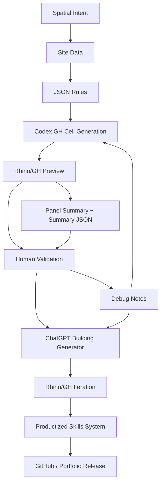

# Workflow Map

## Reading the map

The workflow starts with spatial intent, not with code. Data and rules make the intent explicit. Codex can then generate first-pass GH Python cells, but Rhino/GH preview and human validation decide whether the output is usable. Complex building generators are treated as a separate loop because facade logic and visual quality require a different level of judgment.

