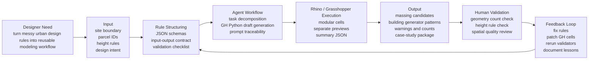

# AI Product Flow Diagram

This diagram explains the Spatial AI Modeling System as an Agent-assisted urban modeling workflow.

## Product Manager Reading

- **User problem:** Urban modeling workflows are difficult to reproduce, debug, and explain.
- **Agent role:** Help structure rules, generate modular GH Python cells, and produce validation artifacts.
- **Output value:** A reusable workflow system rather than a one-off model.
- **Validation:** Human review in Rhino/GH decides whether geometry is usable.
